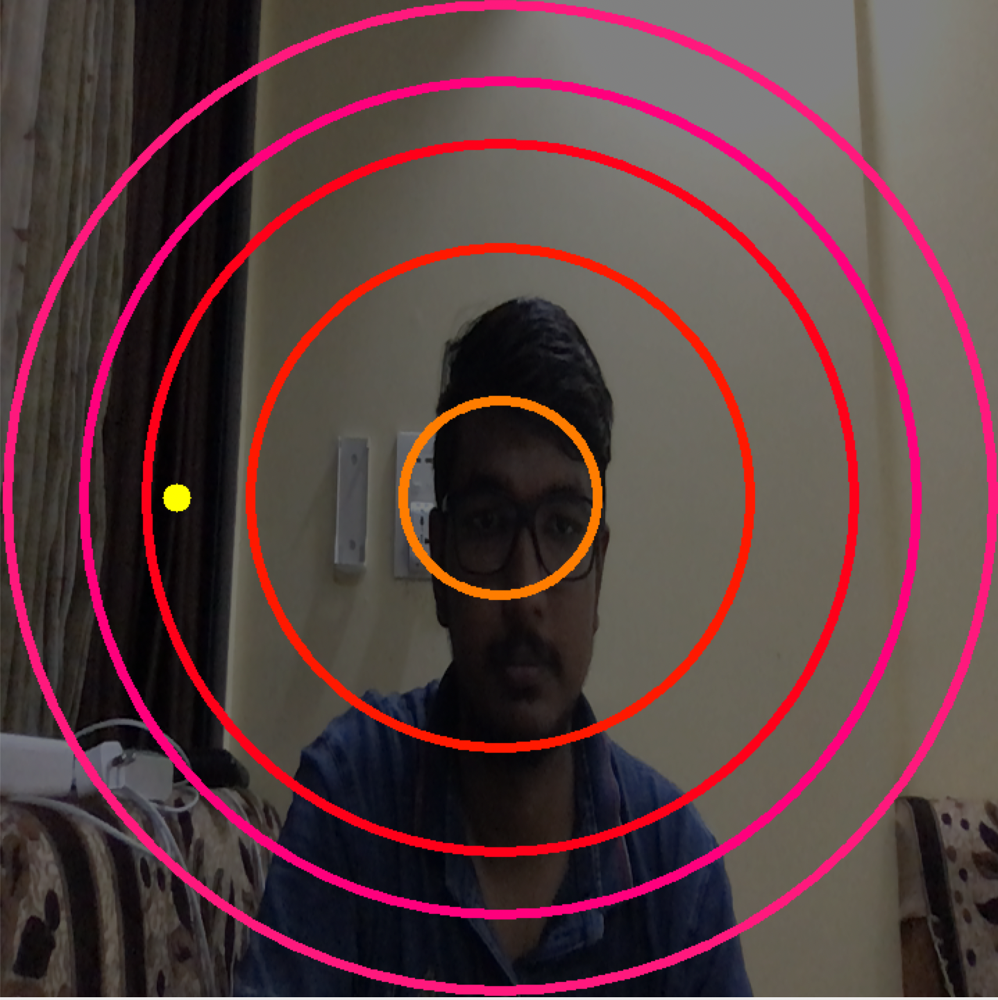

# Cervical trainer
 This project was made for curing or easing the treatment for cervical pain mostly used by doctors.

 ## Run
  To run this project simply connect bluetooth using arduino to the laptop and run the python file

  $ python3 head_exercise.py

## Hardware
    In this project we need one 328p IC and one MPU6050 sensor which is a 6 - axis gyroscope and accelerometer sensor and also one bluetooth sensor which will be used to transmit data from MPU6050, I have used HC05 for this project.
## Sample Image
  
